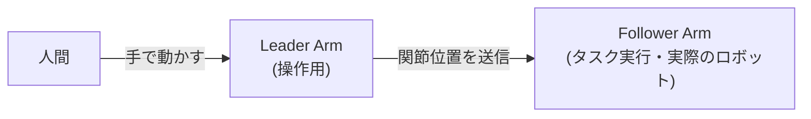
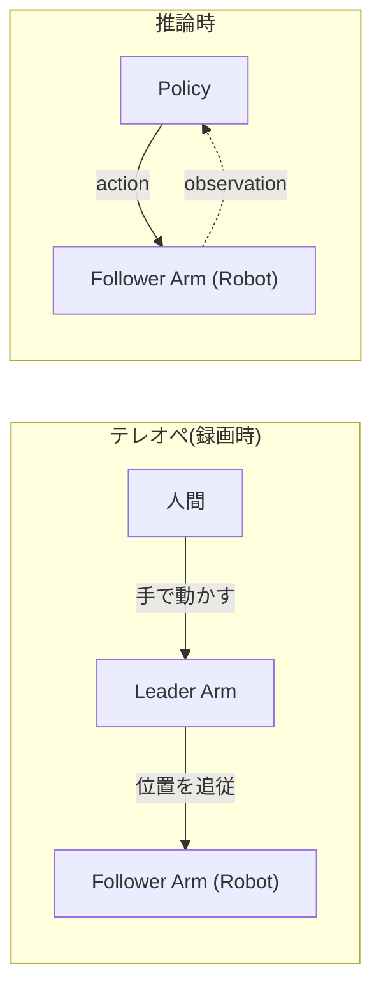

> **シリーズ:** LeRobot チュートリアル — 第 0 回(前提知識リファレンス)
> 最初に一度読んで、以降の各記事から参照する位置づけです。

## この記事の目的

LeRobot を始めたときに「最初から知っていれば詰まらなかった」内容をまとめました。用語、環境、ログの読み方、データの保存場所など、各チュートリアルで毎回説明すると冗長になる事項をここに集約します。

## 環境チートシート

| 項目 | 値 |
|------|-----|
| OS | Ubuntu 22.04 |
| Python | 3.10 以上 |
| パッケージマネージャ | `uv`  |
| ロボットアーム | `SO-101` |

セットアップコマンド:

```bash:terminal
# venv を作成
uv venv

# 有効化
source .venv/bin/activate

# LeRobot をインストール
uv pip install lerobot
```

> インストールの詳細手順は [第 1 回(インストールとキャリブレーション)](./lerobot-install-and-calibration) を参照してください。

## ハードウェアのクイックリファレンス

### Leader と Follower

LeRobot のテレオペは **2 本のアーム** を使う構成です。役割が違うので最初に区別しておきます。

- **Leader Arm(リーダーアーム)**: 人間が手でつかんで動かす側のアーム。サーボは位置を読み取るモードで動作し、関節角度を逐次取得して Follower に送ります。
- **Follower Arm(フォロワーアーム)**: 受信した関節位置に追従して実際にタスクを実行する側。これが「ロボット」本体で、エピソードの録画でも推論でも最終的に動作するのはこちらです。



SO-101 の場合、Leader と Follower は見た目はよく似ていますが、Leader にはグリッパー操作用のレバーが付いており、人間が握って動かせるようになっています。

### USB とシリアルポート

LeRobot がロボットを認識するときのデバイスパスです。ロボットアームは Linux では `/dev/ttyACM*` または `/dev/ttyUSB*` として見えます。

```bash:terminal
# Linux
ls /dev/ttyACM* /dev/ttyUSB*
```

### カメラ

カメラは Linux ではデバイスパス(`/dev/video0` など)で識別されます。

:::message alert
カメラのインデックスは再起動や USB ハブの抜き差しで **変わる可能性があります**。可能ならシリアル番号で固定してください。
:::

```bash:terminal
lerobot-find-cameras opencv
```

実行すると、検出されたカメラの一覧と各カメラのプロファイルが出力されます。

::::details `lerobot-find-cameras opencv` の出力例
```text
--- Detected Cameras ---
Camera #0:
  Name: OpenCV Camera @ /dev/video0
  Type: OpenCV
  Id: /dev/video0
  Backend api: V4L2
  Default stream profile:
    Format: 0.0
    Fourcc: YUYV
    Width: 640
    Height: 480
    Fps: 30.0
--------------------
Camera #1:
  Name: OpenCV Camera @ /dev/video2
  Type: OpenCV
  Id: /dev/video2
  Backend api: V4L2
  Default stream profile:
    Format: 0.0
    Fourcc: YUYV
    Width: 640
    Height: 480
    Fps: 30.0
--------------------

Finalizing image saving...
Image capture finished. Images saved to outputs/captured_images
```
::::

:::message
`lerobot-find-cameras opencv` を実行すると、カレントディレクトリに `outputs/captured_images/` フォルダが作成され、検出された各カメラから 1 枚ずつキャプチャ画像が保存されます。どのカメラがどの位置(正面・手首など)に対応しているかを、この画像で確認できます。
:::

## データの保存場所

LeRobot がデフォルトで使うパスです。

| 内容 | パス |
|------|-----|
| Hugging Face のキャッシュ(データセット・モデル) | `~/.cache/huggingface/` |
| LeRobot データセットキャッシュ | `~/.cache/huggingface/lerobot/` |
| キャリブレーションファイル | `~/.cache/huggingface/lerobot/calibration/` |
| ローカルのチェックポイント(トレーニング出力) | `outputs/train/<run-name>/` |

「録画やトレーニングに失敗した?」と思ったら、まずこのパスを確認してください。多くの場合、ファイル自体は書き出されています。

## 用語集

**Episode** — タスクを開始から完了まで一度実行する **1 回分の記録**。連続した長い録画ではなく、独立したひとつのデモンストレーションが 1 エピソードです。50 エピソード録画する = 50 回タスクを実行する、という意味になります。エピソード間には環境(物体の位置など)をリセットします。

**Reset time** — エピソードとエピソードの間の待ち時間。この時間に環境をリセットし、次のエピソードを録画できるようにします。例えば、物体を箱に入れるタスクの場合、前のエピソードが完了した時点では物体が箱の中に入っていますが、この状態では次のエピソードの録画は開始できません。Reset time の間に物体を箱から出し、初期状態に戻す必要があります。CLI が環境のリセットを指示し、タイマーが切れると次のエピソードが始まります。

**Episode duration** — 1 エピソードの最大時間(秒)。この時間に達すると自動的に録画が止まります。Episode duration が経つまで待たずに、途中で右矢印キーを押すことで録画を停止することもできます。

**Dataset** — 複数のエピソード(カメラ映像、モーター位置、アクション)+ メタデータを [LeRobotDataset](https://huggingface.co/docs/lerobot/lerobot-dataset-v3) という LeRobot 専用のフォーマットで保存したもの。Hugging Face の標準データセット形式ではありませんが、Hub はフォルダ単位で受け入れるためそのままプッシュできます。

**Teleop** — Leader Arm を人間が動かし、Follower Arm がそれにリアルタイムに追従する操作方法。デモンストレーション収集に使います。

**Policy** — observation → actionを学習したモデル。LeRobot では ACT、Diffusion Policy、TDMPC、Pi0 などがあります。

**Calibration** — モーターのエンコーダの値を物理的な関節角度にマッピングする手順。アームごとに 1 回行い、ファイルとして保存されます。

**Checkpoint** — トレーニング中のポリシー重みのスナップショット。トレーニングの再開時や推論時に使います。

**Inference** — 学習済みポリシーを実行すること。エピソードの録画時と同じロボットを使いますが、テレオペの時と異なり、人間ではなくポリシーがアクションを出します。

## テレオペと推論のフロー

テレオペ(録画時)と推論時では、**誰が action を出すか**が入れ替わります。Robot(Follower Arm)は両方で同じハードウェアです。



- **テレオペ**: 人間が Leader Arm を物理的に動かし、その関節位置を Follower Arm が追従します。録画はこの軌跡を Hugging Face のデータセット形式で保存する作業です。
- **推論**: Leader Arm は不要です。Follower Arm のカメラ・関節状態(observation)を Policy に入力し、Policy が返す action で Follower Arm を動かします。

## ログの読み方

よく出てくるログとその意味です。

| ログ | 意味 |
|------|-----|
| `Recording episode N` | エピソード N の録画開始。タスクを実施してください。 |
| `Reset the environment` | 1 エピソードが終了。次のエピソードに向けて環境(物体の配置など)を初期状態に戻してください。 |
| `Episode duration reached` | `--control.episode_time_s` で指定したエピソード長に到達して自動停止しました。 |
| `Calibration not found` | キャリブレーションファイルが見つかりません。先にキャリブレーションを実行してください。 |
| `Mismatch between calibration values in the motor and the calibration file` | モーター側のゼロ点と保存済みキャリブレーションファイルが一致していません。Enter で既存ファイルを使うか、`c` を押して再キャリブレーションします。 |
| `Connected to motor X` | モーター X の接続成功。表示数が実装モーター数より少ない場合は USB かデイジーチェーンケーブルを疑ってください。 |
| `Pushing dataset to hub` | Hugging Face Hub へアップロード中。事前に `huggingface-cli login` が必要です。 |

:::message
迷ったら、まずログを最初の行から読み返してください。多くの問題は CLI のメッセージ自体に答えが書かれています。
:::

## つまずきポイント

- **USB ハブの不安定さ**: 安価なバスパワーハブはモーター通信を取りこぼすことがあります。セルフパワーハブを使うか、PC に直挿ししてください。
- **カメラインデックスのズレ**: USB の抜き差しでインデックスが入れ替わります。「正面のカメラが急に手首側に見える」原因はだいたいこれです。
- **ファームウェア書き換え後**: モーターのファーム更新後はキャリブレーションが無効になるため、再キャリブレーションが必要です。
- **Python 環境の混在**: ある venv で `pip install lerobot` し、別の venv から `lerobot` を実行する、というケースが「command not found」「バージョンが違う」の最頻原因です。
- **データセットのパス衝突**: 同じ `--repo-id` で再録画すると上書き or 追記になります。CLI の確認プロンプトを必ず読んでください。
- **`robot.id` の不一致**: キャリブレーションファイルは `--robot.id` をキーに保存・読み込みされます。teleop で指定した id がキャリブレーション時の id と違うと、毎回再キャリブレーションを促されます。

## LeRobot を効率よく学ぶための Tips

- **CLI のフラグ全部読んでおく**: `lerobot record --help` や `lerobot train --help`。最初は意味不明でも、目を通しておくと後で「あの挙動は◯◯フラグだったな」と思い出せます。
- **トレーニング前にデータセットを確認する**: `lerobot.scripts.visualize_dataset` で再生して、想定どおりの記録になっているか見てから学習に進みます。
- **最小構成でまず通す**: エピソード数・バッチサイズ・トレーニングステップを最小にして、パイプライン全体をエンドツーエンドで一度通してから本番設定に上げます。
- **ログを保存する**: `tee` で録画・学習のログを必ずファイルに残してください。数日後に何かが壊れたとき、過去ログが救命具になります。

## 参考リンク

- [LeRobot リポジトリ](https://github.com/huggingface/lerobot)
- [LeRobot examples](https://github.com/huggingface/lerobot/tree/main/examples)
- [Hugging Face データセットビューア](https://huggingface.co/docs/dataset-viewer/index)
- シリーズ第 1〜5 回(公開され次第ここにリンクします)
